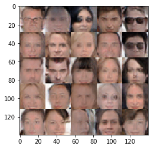

# Face Generation using GANs

The scope of this project is to generate realistic faces using [Generative Adversarial Networks](https://en.wikipedia.org/wiki/Generative_adversarial_network),
trained on [CelebA](http://mmlab.ie.cuhk.edu.hk/projects/CelebA.html) dataset.

The model follows traditional GAN architecture (generator and discriminator) with batch normalization and sigmoid cross entropy loss.

Here is an example result at around 3 epochs:

## GANs Articles

To generate more realistic faces, the various GAN types are better suited. Here are a few articles describing some of them:

[Delving deep into GANs](http://gkalliatakis.com/blog/delving-deep-into-gans)

[How to Train a GAN? Tips and tricks to make GANs work](https://github.com/soumith/ganhacks)

[Stability of Generative Adversarial Networks](http://www.araya.org/archives/1183)

[BEGAN: State of the art generation of faces with Generative Adversarial Networks](https://blog.heuritech.com/2017/04/11/began-state-of-the-art-generation-of-faces-with-generative-adversarial-networks/)

[DiscoGAN in PyTorch](https://github.com/carpedm20/DiscoGAN-pytorch)

[Wasserstein GAN (WGAN)](https://www.cph-ai-lab.com/wasserstein-gan-wgan)

[BEGAN in Tensorflow](https://github.com/carpedm20/BEGAN-tensorflow)
